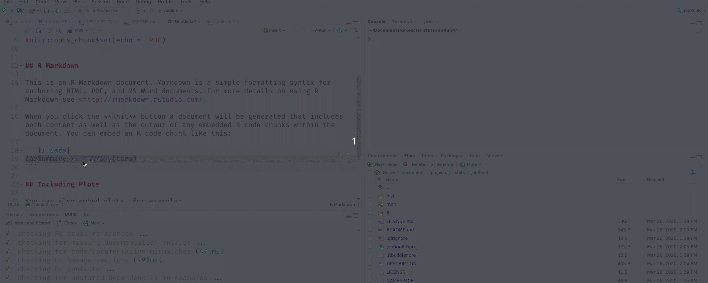

# jobRunR

<!-- badges: start -->
<!-- badges: end -->

## Installation

You can install jobRunR from [github](https://github.com/) with:

``` r
remotes::install_github("jannikbuhr/jobRunR")
```

## Example

Use this package as an RStudio addin, there is
no need to load it explicitly. Simply select a piece
of code and use the addin menue to run it as a job.


This means that it also works from Rmarkdown documents
with a chunk highlighted (press Ctrl+Shif+Up to expand
the selection as far as needed).


